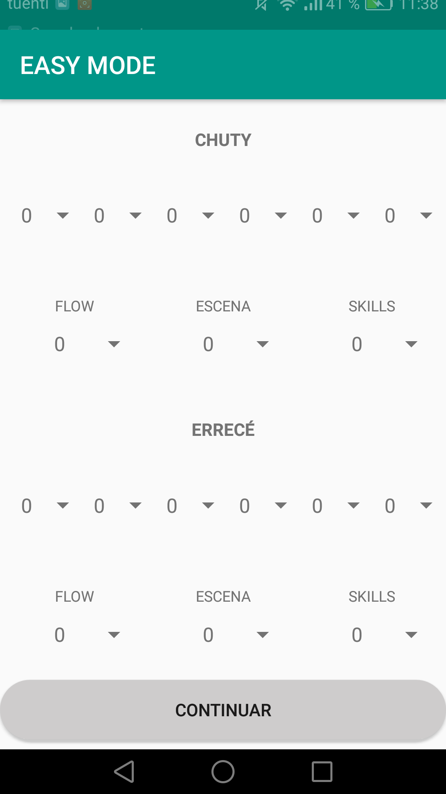
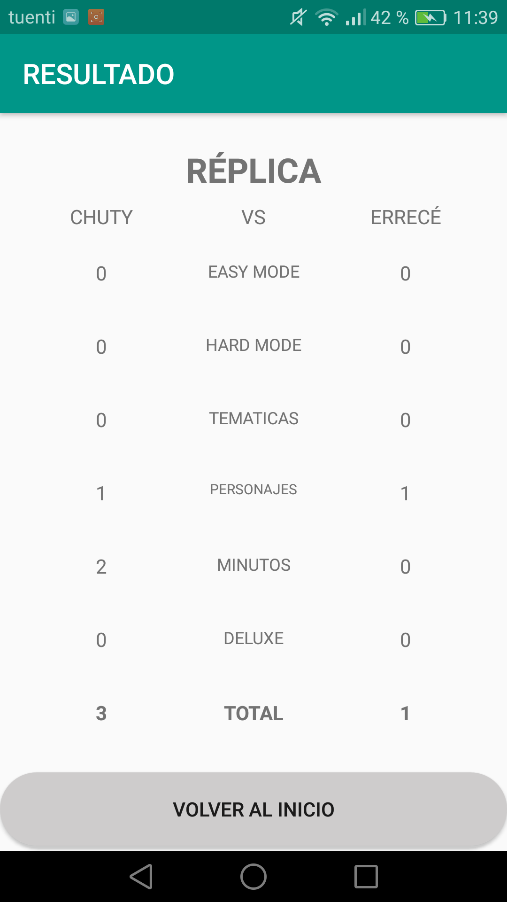

# Votacion-FMS-No-Oficial

Esta no es la app oficial de Urban Roosters simplemente es el pasatiempo de un joven estudiante que quiso hacer su propia app de votaciones de FMS (Fresstyle Master Series), debido a que no habia en la play store una app así, bueno si pero tenia mucha publicidad. La app no es perfecta, pero cumple su función.

## Descarga el apk

[Votacion-FMS-No-Oficial.apk](https://mega.nz/#!eOhGnCDa!4LHJf8a99-7J5vxNsFH_qRX2vypH4jiV7WyA4ru5fTY)

## Uso

- Escoge la liga que vas a votar. Existe la opción de personalizado por si quieres escoger 2 participantes de diferente liga o si es una exhibición con formato FMS.

- Escoge los participantes que van a participar. Es importante que saber que el participante que comienza el easy mode sea el primero, o sea el spinner de la parte izquierda

- Comienza a puntuar los patrones

- En la ronda de personajes marca el checkbox si el MC utiliza bien su personaje.

- En los minutos a Sangre marca el checkbox si el MC da una respuesta a su contricante que le haya tirado en su minuto.

- Cuando hayas terminado las rondas, te saldrá el resultado

